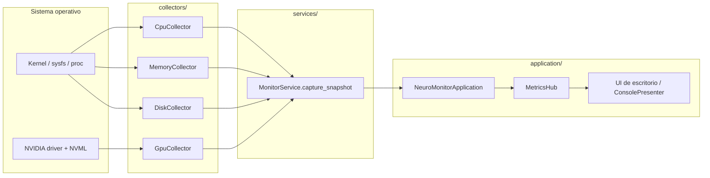

# NeuroMonitor — Arquitectura Backend (Aplicación de Escritorio)

## 1. Estructura de carpetas y módulos

```
NeuroMonitor/
├── main.py                     # Entrada: python main.py
├── pyproject.toml
├── requirements.txt
├── requirements-gpu.txt        # pynvml opcional (NVIDIA)
├── .env.example
├── ARCHITECTURE.md
└── src/neuromonitor/
    ├── main.py                 # CLI + arranque de la app
    ├── config/
    │   └── settings.py         # Intervalo de polling, GPU, nombre app
    ├── models/
    │   ├── metrics.py          # DTOs por dominio (CPU, RAM, disco, GPU)
    │   └── snapshot.py         # Agregado SystemSnapshot para la UI
    ├── collectors/             # Lectura del SO (psutil / pynvml)
    │   ├── base.py             # Contrato MetricCollector
    │   ├── cpu.py
    │   ├── memory.py
    │   ├── disk.py
    │   └── gpu.py
    ├── services/
    │   └── monitor_service.py  # Composición de snapshot
    └── application/            # Capa de app de escritorio
        ├── app.py              # NeuroMonitorApplication (ciclo de vida)
        ├── events.py           # MetricsHub (pub/sub in-process)
        └── console.py          # Presentador consola (headless / debug)
```

### Responsabilidades por capa

| Capa | Responsabilidad | No debe |
|------|-----------------|---------|
| **collectors** | Leer kernel/SO vía psutil (y pynvml si hay GPU NVIDIA) | Conocer UI ni threading |
| **models** | Validar y serializar datos (Pydantic) | Llamar al SO |
| **services** | Componer `SystemSnapshot` desde collectors | Gestionar ciclo de vida de la app |
| **application** | Polling en background, pub/sub hacia UI, shutdown | Lógica de lectura de sensores |
| **config** | Parámetros operativos centralizados | Lógica de negocio |

---

## 2. Modelos de datos

Todos los modelos viven en `models/` y se agrupan en **`SystemSnapshot`**, un único payload para la UI.

### Tipos principales

- **`CpuMetrics`**: uso global %, por núcleo (`CpuCoreMetrics[]`), frecuencia, load average (Linux), conteo de cores.
- **`MemoryMetrics`**: RAM total/usada/disponible %, swap total/usado/%.
- **`DiskMetrics`**: lista de particiones montadas (`DiskPartitionMetrics`) + I/O lectura/escritura bytes/s (delta entre muestras).
- **`GpuMetrics`**: `available`, lista `GpuDeviceMetrics` (utilización, VRAM, temperatura) o `message` si no hay driver/NVML.
- **`SystemSnapshot`**: `timestamp` (UTC), `hostname`, y los cuatro bloques anteriores.

### Enumeración

- **`MetricKind`**: `cpu` | `memory` | `disk` | `gpu` — útil si la UI filtra o pinta por tipo.

### Contrato JSON (ejemplo reducido)

```json
{
  "timestamp": "2026-05-31T12:00:00Z",
  "hostname": "workstation",
  "cpu": { "percent": 42.1, "per_core": [{"core_id": 0, "percent": 38.0}], "logical_cores": 16 },
  "memory": { "total_bytes": 17179869184, "used_bytes": 8589934592, "percent": 50.0 },
  "disk": { "partitions": [{ "mountpoint": "/", "percent": 65.0 }] },
  "gpu": { "available": true, "devices": [{ "name": "NVIDIA GeForce ...", "utilization_percent": 12.0 }] }
}
```

---

## 3. Flujo de datos (SO → backend → UI)



### Secuencia temporal

1. `main.py` crea `NeuroMonitorApplication` y registra suscriptores en `MetricsHub`.
2. `app.start()` lanza un hilo daemon `neuromonitor-metrics`.
3. Cada `poll_interval_ms` (default 1000 ms) el hilo llama `MonitorService.capture_snapshot()`.
4. El snapshot se publica a todos los suscriptores (UI nativa, webview embebida, consola).
5. `Ctrl+C` o `app.stop()` detiene el hilo y ejecuta `GpuCollector.shutdown()`.

### Integración con UI de escritorio (futuro)

La UI no consume HTTP. Se suscribe al hub:

```python
app = NeuroMonitorApplication()
app.subscribe(mi_widget.actualizar_metricas)
app.run_forever()
```

Frameworks recomendados: **PySide6/PyQt6** (nativo), **pywebview** (React embebido), **CustomTkinter** (ligero).

---

## 4. Obtención de datos del sistema operativo

| Métrica | Librería | APIs / notas |
|---------|----------|----------------|
| CPU % | **psutil** | `cpu_percent(percpu=True)`, `cpu_freq()`, `cpu_count()` |
| Load avg | **os** (Linux) | `os.getloadavg()[0]` |
| RAM / swap | **psutil** | `virtual_memory()`, `swap_memory()` |
| Disco por partición | **psutil** | `disk_partitions()`, `disk_usage(mountpoint)` — ignora permisos denegados |
| I/O disco | **psutil** | `disk_io_counters()` + delta temporal local en `DiskCollector` |
| GPU NVIDIA | **pynvml** (opcional) | NVML: utilización, memoria, temperatura; requiere drivers propietarios |

### Extensiones futuras

- **AMD GPU**: `pyamdgpuinfo` o lectura sysfs.
- **Intel iGPU**: sysfs / `intel_gpu_top`.
- **Red / procesos**: nuevos collectors + campos en snapshot.
- **Historial**: capa `storage/` con SQLite alimentada por el hilo de polling.

---

## 5. Recomendaciones técnicas

### Rendimiento

- Polling en hilo dedicado; la UI solo recibe callbacks (no bloquea el main thread).
- `CpuCollector` usa `sample_interval` corto (50 ms) solo en el hilo de recolección.
- Ajustar `NEUROMONITOR_POLL_INTERVAL_MS`: 500–1000 ms suele bastar para dashboards.

### Seguridad

- App local: no expone puertos de red por defecto.
- No ejecutar como root salvo que se necesiten métricas de procesos ajenos.

### Operación

```bash
cd /home/darking/proyectos_ia/NeuroMonitor
python -m venv .venv && source .venv/bin/activate
pip install -e .
pip install -r requirements-gpu.txt   # solo si hay GPU NVIDIA
cp .env.example .env

python main.py              # stream en consola
python main.py --once       # una muestra
python main.py --output json
neuromonitor                # entry point instalado
```

### Evolución del diseño

- Nueva métrica → collector + campo en `SystemSnapshot` + actualizar presentador UI.
- UI gráfica → suscriptor en `MetricsHub`; el backend no cambia.
- Empaquetado → PyInstaller / briefcase sobre `main.py`.
