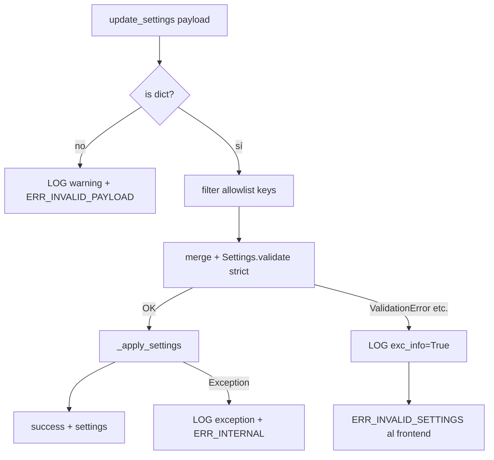

# Análisis QA — `NeuroMonitorBridge.update_settings`

**Componente:** `neuromonitor/bridge/pywebview_bridge.py`  
**Fecha:** 2026-05-31  
**Rol:** QA Senior — escenarios de fallo y contrato de error  
**Alcance:** RPC pywebview `update_settings`; sin código de producción.

---

## 1. Arquitectura actual

### Flujo

```
Frontend (JS)
    │ pywebview.api.update_settings(payload)
    ▼
NeuroMonitorBridge.update_settings(settings_dict)
    │ isinstance(dict)? ──no──► { success: false, error: "settings_dict debe ser..." }
    │ sí
    ▼
merged = app._settings.model_dump()
merged.update(settings_dict)          ← merge parcial (patch)
    ▼
Settings.model_validate(merged)       ← Pydantic v2
    ▼
_apply_settings(validated)            ← mutación in-place en app._settings
    ▼
{ success: true, settings: {...} }
```

### Restricciones en `Settings` (relevantes al bridge)

| Campo | Validación | Default |
|-------|------------|---------|
| `poll_interval_ms` | `int`, `ge=100`, `le=60_000` | 1000 |
| `enable_gpu` | `bool` | true |
| `app_name` | `str` | "NeuroMonitor" |
| `host`, `port`, `allow_remote`, … | Validadores adicionales | — |

`extra="ignore"` solo aplica a variables de entorno; en `model_validate(merged)` las claves desconocidas del dict **sí** pueden entrar si están en el modelo.

### Comportamiento de error actual (L75-80)

```python
except (ValidationError, TypeError, ValueError) as exc:
    logger.warning("Error validando configuración: %s", exc)
    return self._error_response(str(exc))
```

**Problemas detectados:**

| # | Problema | Severidad |
|---|----------|-----------|
| P1 | El frontend recibe el string crudo de Pydantic (`str(exc)`) | Alto |
| P2 | No existe código estable (`ERR_INVALID_SETTINGS`) | Alto |
| P3 | Mensajes en español mezclados con inglés de Pydantic | Medio |
| P4 | `logger.warning` sin `exc_info=True` en ValidationError | Medio |
| P5 | Respuesta de tipo incorrecto usa mensaje distinto al de validación | Bajo |
| P6 | Coerción Pydantic puede aceptar tipos ambiguos (`"false"` → `True`) | Medio |

---

## 2. Escenario de fallo principal — F8.1

### F8.1 — Frontend envía `poll_interval_ms` corrupto o malicioso

| Campo | Detalle |
|-------|---------|
| **Vector** | DevTools / script inyectado / bug de serialización en UI |
| **Payload** | `{ "poll_interval_ms": null }` o `-1`, `0`, `"abc"`, `1e308`, objeto anidado |
| **Estado** | 🔴 Contrato de error incorrecto (filtra excepción interna) |
| **Blast radius** | Bajo si validación falla antes de `_apply_settings`; **Alto** si coerción acepta valor límite (100 ms → tormenta de polling) |

#### Secuencia esperada (contrato deseado)

```
1. Bridge recibe payload
2. Merge + validate → ValidationError | TypeError | ValueError
3. LOG interno (WARNING/ERROR):
     - logger.warning("Invalid settings from frontend", exc_info=True)
     - o logger.exception(...) con payload sanitizado (sin secretos)
4. Respuesta al frontend (NUNCA str(exc)):
     {
       "success": false,
       "code": "ERR_INVALID_SETTINGS",
       "error": "Configuración inválida"   // mensaje genérico i18n-ready
     }
5. app._settings NO mutado (validación antes de apply — ya cumplido)
```

#### Secuencia actual (observada por análisis estático)

```
3. LOG: logger.warning("Error validando configuración: %s", exc)  // sin stack
4. Respuesta:
     {
       "success": false,
       "error": "1 validation error for Settings\npoll_interval_ms\n  Input should be..."
     }
```

**Impacto de filtración:** El string Pydantic revela nombres de campos internos, constraints (`ge=100`), y mensajes del validador de `host`/`allow_remote` si el atacante envía `{ "host": "0.0.0.0" }`.

---

## 3. Matriz de payloads maliciosos / corruptos

| ID | Payload | Excepción esperada | ¿Mutación? | Respuesta ideal | Riesgo |
|----|---------|-------------------|------------|-----------------|--------|
| TC-BR-006 | `{"poll_interval_ms": null}` | ValidationError | No | `ERR_INVALID_SETTINGS` | Medio |
| TC-BR-007 | `{"poll_interval_ms": -500}` | ValidationError (ge) | No | `ERR_INVALID_SETTINGS` | Medio |
| TC-BR-008 | `{"poll_interval_ms": 0}` | ValidationError (ge) | No | `ERR_INVALID_SETTINGS` | Medio |
| TC-BR-009 | `{"poll_interval_ms": 50}` | ValidationError (ge) | No | `ERR_INVALID_SETTINGS` | Medio |
| TC-BR-010 | `{"poll_interval_ms": 999999}` | ValidationError (le) | No | `ERR_INVALID_SETTINGS` | Bajo |
| TC-BR-011 | `{"poll_interval_ms": "1000"}` | — (coerción → OK) | Sí | success (documentar) | Medio |
| TC-BR-012 | `{"enable_gpu": "false"}` | — (coerción → **True**) | Sí | success **incorrecto** | **Alto** |
| TC-BR-013 | `{"poll_interval_ms": {"x": 1}}` | ValidationError | No | `ERR_INVALID_SETTINGS` | Bajo |
| TC-BR-014 | `"not-a-dict"` | — (guard previo) | No | `ERR_INVALID_SETTINGS` o `ERR_INVALID_PAYLOAD` | Bajo |
| TC-BR-015 | `{"host": "0.0.0.0"}` | ValueError (validator) | No | `ERR_INVALID_SETTINGS` (sin filtrar allow_remote) | **Alto** |
| TC-BR-016 | `[]` (array JSON) | guard isinstance | No | código genérico | Bajo |
| TC-BR-017 | `{"app_name": "A" * 100_000}` | posible OK | Sí | success o límite max_length | Medio |

---

## 4. Casos de prueba (laboratorio LAB_06)

Automatizados en `qa/labs/LAB_06_bridge_history.py` (sección *Settings — contrato de error*).

### Criterios de PASS

- `success is False`
- `code == "ERR_INVALID_SETTINGS"` (campo nuevo requerido)
- `error` es mensaje genérico; **no** contiene subcadenas `"validation error"`, `"Input should"`, `"ge="`, `"NEUROMONITOR_"`
- Tras fallo, `app._settings.poll_interval_ms` igual al valor previo al intento
- Log interno registrado (verificación manual o mock de `logging` en pytest futuro)

### Criterios de FAIL actual (deuda conocida)

Hasta que desarrollo implemente el contrato, LAB_06 marca **FAIL** en TC-BR-006..010,015 cuando `code` ausente o `error` contiene texto Pydantic.

---

## 5. Riesgos

| ID | Riesgo | Nivel | Evidencia |
|----|--------|-------|-----------|
| R-025 | Filtración de excepciones Pydantic al frontend vía `str(exc)` | **Alto** | L77 `pywebview_bridge.py` |
| R-026 | Coerción bool: `"false"` → GPU sigue activa | **Alto** | Pydantic strict mode off |
| R-027 | Intervalo mínimo 100 ms aplicado en caliente → CPU spike | **Medio** | `Settings` ge=100 + `_poll_loop` |
| R-028 | Sin campo `code` → UI no puede i18n ni retry inteligente | **Medio** | `_error_response` solo `error` |
| R-029 | Payload `host`/`port` vía bridge bypassa intención desktop-only | **Medio** | merge incluye campos API |
| R-030 | Logs de validación sin stack → diagnóstico lento | **Bajo** | `logger.warning` sin exc_info |

---

## 6. Recomendaciones concretas (especificación, no producción)

### REC-025 — Contrato de error estable en bridge

| Campo | Valor |
|-------|-------|
| **Qué** | Extender `_error_response(code, message)` → `{ success, code, error }` |
| **Validación** | TC-BR-006..010 PASS en LAB_06 |
| **Códigos** | `ERR_INVALID_SETTINGS`, `ERR_INVALID_PAYLOAD`, `ERR_INTERNAL` |

### REC-026 — Logging con excepción real, respuesta opaca

| Campo | Valor |
|-------|-------|
| **Qué** | En except de validación: `logger.warning("...", exc_info=True)` + payload truncado |
| **Frontend** | Solo `code` + mensaje genérico |
| **Criterio** | Log contiene traceback; respuesta JSON no contiene "ValidationError" |

### REC-027 — Validación estricta de tipos en Settings patch

| Campo | Valor |
|-------|-------|
| **Qué** | `Settings.model_validate(merged, strict=True)` o schema bridge-only con solo `poll_interval_ms`, `enable_gpu`, `app_name` |
| **Por qué** | R-026: evitar `"false"` → True |
| **Criterio** | TC-BR-012 → `ERR_INVALID_SETTINGS` |

### REC-028 — Allowlist de campos mutables desde UI

| Campo | Valor |
|-------|-------|
| **Qué** | Bridge solo acepta claves en `{"poll_interval_ms", "enable_gpu", "app_name"}`; rechazar resto con WARN en log |
| **Por qué** | R-029: no permitir retarget API host desde JS |
| **Criterio** | TC-BR-015 rechazado sin filtrar mensaje de bind remoto |

### REC-029 — Propagación atómica post-validación

| Campo | Valor |
|-------|-------|
| **Qué** | Mantener orden validate-then-apply; opcional snapshot de settings previo para rollback si `_apply_settings` falla |
| **Estado actual** | ✅ validate antes de apply |
| **Gap** | `_apply_settings` no sincroniza `MonitorService` (TC-BR-005 WARN existente) |

---

## 7. Diagrama de decisión (bridge)



---

## 8. Referencias de código

- Bridge: `neuromonitor/bridge/pywebview_bridge.py` L55-94
- Settings: `neuromonitor/config/settings.py` L18-41
- Lab existente: `qa/labs/LAB_06_bridge_history.py`
- Escenarios: `qa/FAILURE_SCENARIOS.md` § F8
